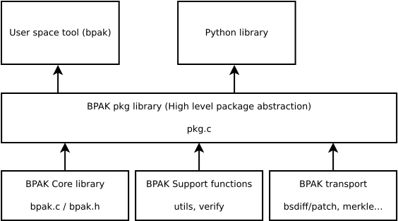

------------
Architecture
------------

The bpak tool and library is organized in a few levels where the lower level
components are more freestanding than the higher level ones.

The core part of the library is ususally the only thing used on a constrained
embedded system that might provide, for example, crypto primitives through hardware.

The 'pkg' module ties all of the low level components together in the C library.
The library does not include any facilities for signing and verifying as this is
supplied by mbedtls in the command line tool or the ecdsa module in the python wrapper.

The reasoning for this that signing function is only provided as a convenience
function in the tool and users are encuraged to not use this with 'real' keys.
Instead most systems rely on a hardware security module(HSM) with it's own
signing environment. The BPAK tool supports a signing flow where the binary hash
can be exported and a DER encoded signature can be imported from those environments.

.. toctree::
   :maxdepth: 1
   :glob:
